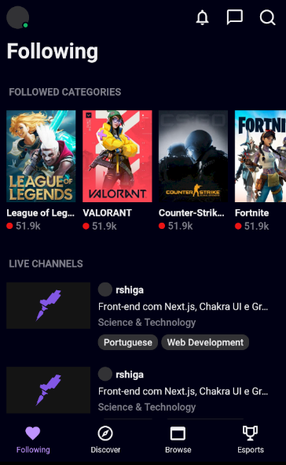

<h1 align="center">
  Twitch Clone
</h1>

<h3 align="center">
<strong>Project based on <a href="https://www.youtube.com/watch?v=bJVp_vlvMwQ&ab_channel=Rocketseat" target="_blank">Rocketseat video </a></strong>
</h3>

  
  
  
  
   
   
  <a href="#space_invader-technologies">Technologies</a>
   
   
  
   
   

## :space_invader: Technologies

- React Native
- Typescript
- [styled components](https://styled-components.com/)
